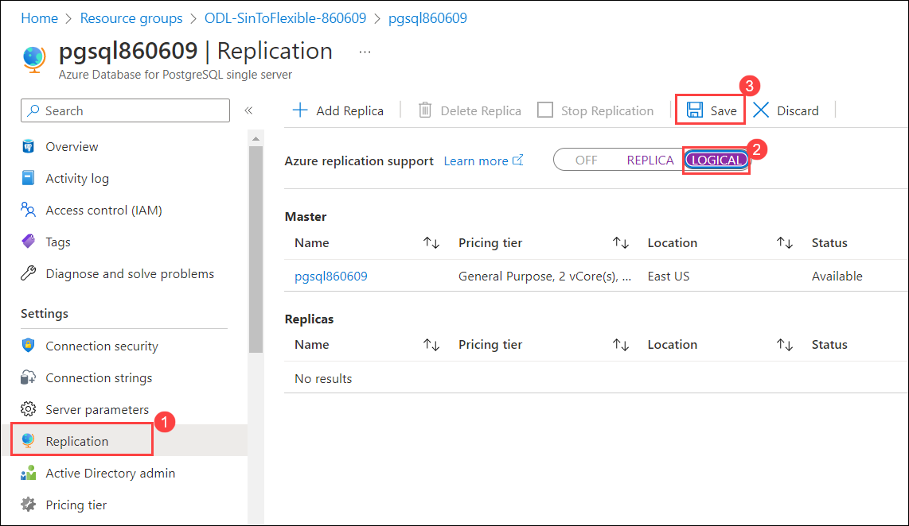
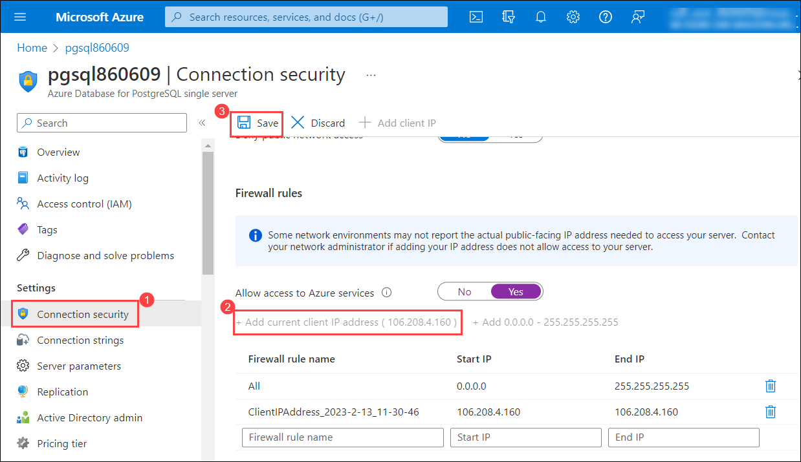
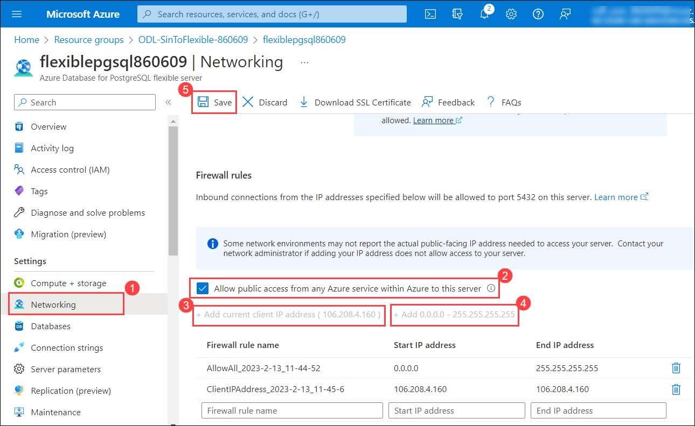
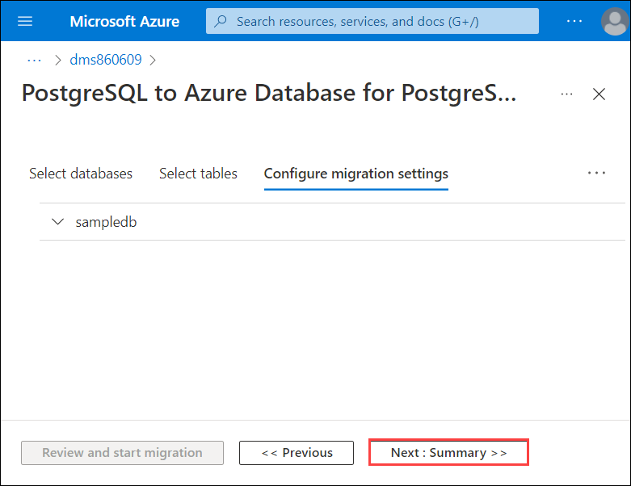
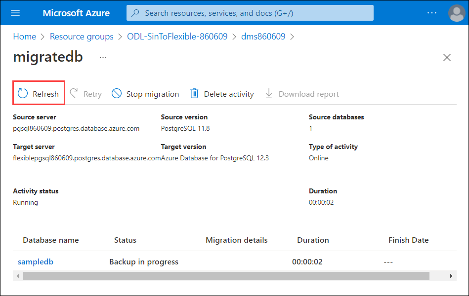
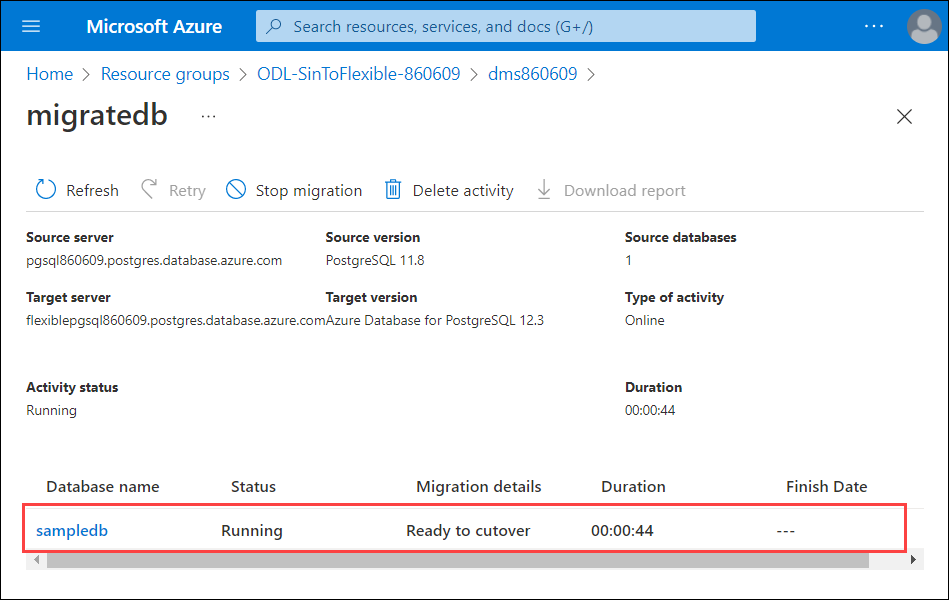
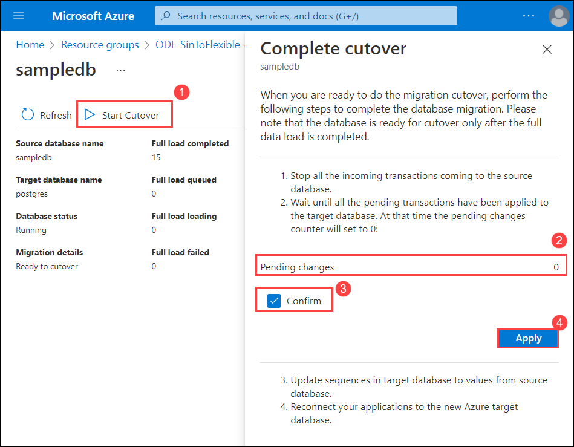
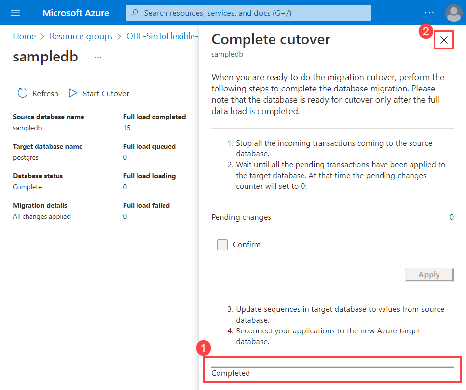
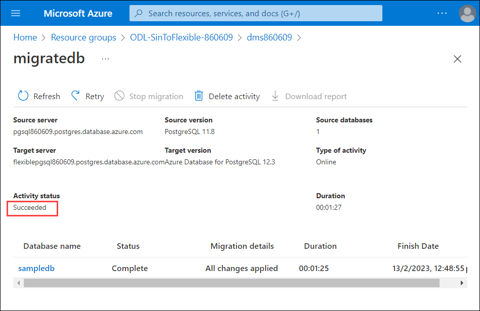
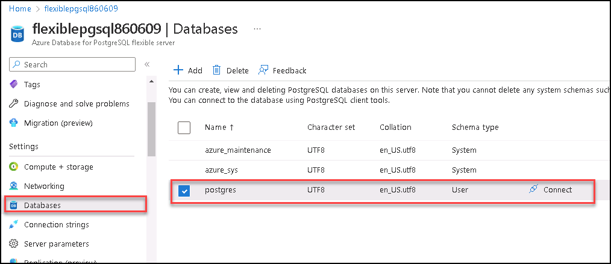

# Exercise -3: Migrating the database from single to flexible postgresql server using the online method

In this exercise you will be migrating the database from Single PostgreSQL server to Flexible PostgreSQL Server using the Azure Data migration service.

## Task 1: Migrating the database from single to flexible postgresql server using the online method


1. In Azure Portal, click on **Resource groups** from the Navigate panel.
    
    
    
2. From the Resource groups page, click on **ODL-SinToFlexible-<inject key="DeploymentID" enableCopy="false"/>**.
    
    

3. From the **Overview (1)** tab, select **pgsql<inject key="DeploymentID" enableCopy="false"/>**.

    
    
4. Follow the below instructions on **pgsql<inject key="DeploymentID" enableCopy="false"/>** page:

   - Click on **Replication (1)** under Settings.
   - Azure replication support : Choose **Logical (2)**.
   - Click on **Save (3)**.

   

5. To enable Firewall rules on Azure services, follow the below instructions:

   - Click on **Connection security (1)**
   - Select **+ Add current client IP address (2)**
   - Click on **Save (3)**.
   
   
   
6. Follow the below instructions to enable the Vnet rules:

    - Scroll down to the VNET rules and click on **+ Adding existing virtual network (1)**
    - Name: Enter name as **pgsqlvnet (2)**
    - Subnet name: Choose **subnet (3)** from the drop-down
    - Click on **Ok (4)**

    
    
7. Navigate back to the resource group and select the Azure Database for PostgreSQL flexible server **flexiblepgsql<inject key="DeploymentID" enableCopy="false"/>** from the **Overview** tab.
 
    
    
8. Follow the below instructions on **flexiblepgsql<inject key="DeploymentID" enableCopy="false"/>** page:

   - Click on **Networking (1)**
   - Check the box next to **Allow public access from any Azure service within Azure to this server (2)**
   - Select **+ Add current client IP address (2)**
   - Select **+ Add 0.0.0.0 -  255.255.255.255 (3)**
   - Click on **Save (4)**.

    
    
9. Minimize the Azure Portal window and search for **Command Prompt (1)** from the Windows Start menu and select it **(2)**.

    
    
10. Run the below-given commands:

    ```
    cd 'C:\Program Files\PostgreSQL\11\bin'
    ```
    
    - Replace the **<DID>** with **<inject key="DeploymentID" enableCopy="true"/>** in the below command and run it.
    - Enter the password **<inject key="PostGre SQL Password" enableCopy="true"/>**
    
    ```
    pg_dump -O -h pgsql<DID>.postgres.database.azure.com -U demouser@pgsql<DID> -d sampledb -s > sampledb.sql
    ```
    
    - Replace the **<DID>** with **<inject key="DeploymentID" enableCopy="true"/>** in the below command and run it.
    - Enter the password **<inject key="PostGre SQL Password" enableCopy="true"/>**
    ```
    psql -h flexiblepgsql<DID>.postgres.database.azure.com -U demouser -d postgres < sampledb.sql
    ```                                                                                             
    

10. Navigate back to Azure Portal and from the **Overview (1)** tab select the Azure Database for PostgreSQL flexible server **dms<inject key="DeploymentID" enableCopy="false"/> (2)**.
    
    
    
4. On the **Azure Database Migration Services** page, click on **+ New migration project**.

    
    
5. On the **New migration project** page, follow the below-given instructions:

   - Project name : Enter **dms-pg-<inject key="DeploymentID" enableCopy="false"/> (1)**
   - Source server type: Choose **PostgreSQL (2)** from the drop-down list.
   - Target server type: Choose **Azure Database for PostgreSQL (3)** from the drop-down
   - Migration activity type: Choose **Online data migration (4)** from the drop-down list.
   - Click on **Create and run an activity (5)**

   
   
   > **Info:** The activity will take around 5 minutes to complete. Once it's created, you will be navigated to **PostgreSQL to Azure Database for PostgreSQL Online Migration Wizard** page.


6. Under the **Select Source** page, follow the below instructions:

   - Source server name :  Enter **pgsql<inject key="DeploymentID" enableCopy="false"/>.postgres.database.azure.com (1)**
   - Server port : Enter **5432 (2)**
   - Database : Enter **sampledb (3)**
   - User Name : Enter **demouser@pgsql<inject key="DeploymentID" enableCopy="false"/> (4)**
   - Password : Enter **<inject key="PostGre SQL Password" enableCopy="true"/> (5)**
   - Check the box next to **Trust server certificate (6)**
   - Click on **Next : Select target > > (7)**

    
    
 7. Under **Select Target** page follow the below instructions:

   - Subscription: Leave subscription as **Defalut (1)**
   - Azure PostgreSQl : Choose **flexiblepgsql<inject key="DeploymentID" enableCopy="false"/> (2)** from the drop down list.
   - Database : Enter **Postgres (3)**
   - User Name : Enter **demouser (4)**
   - Password : Enter **<inject key="PostGre SQL Password" enableCopy="true"/> (5)**
   - Select **Next : Select databases > > (6)**

   
   
8. On the **Select databases** tab, follow the below instructions:

   -  Check the box next to **sampledb (1)**
   -  Target database: Choose **postgres (2)** from the drop-down list.
   -  Click on **Next : Select tables > > (3)**

   
   
9. On **Select tables** tab, expand **sampledb (1)** and verify the tables then click on **Next : Configure migration settings > > (2)**.

   
   
10. On **Configure migration settings** tab, leave everything as default and cilck on **Next : Summary > >**.

    
    
11. On **Summary**, enter the **Activity name** as **migratedb (1)** and click on **Start migration (2)**.

     
     
12. Once the migration has started, you will navigate to migratedb page. Click on **Refresh** periodically to get the current status.

     
     
13. Select the database **sampledb** once you can see the Migration details as **Ready to cutover**.

    
    
14. On **sampledb** page, follow the below instructions:

    - Click on **Start cutover (1)**
    - Make sure the **Pending changes** count as **0 (2)**
    - Check the box next to **Confirm (3)**
    - Click on **Apply (4)**

    
    
15. Once the cutover is completed, click on **X**.

    
    
16. Navigate back to the **migratedb** page to check the migration process. After the database has migrated, you can observe the **Activity status** as **Succeeded**.

    
    
Task 2: Review the newly migrated Database from Azure Postgres Flixeble server.
    
1. Navigate back to Azure Portal and from the **Overview (1)** tab select the Azure Database for PostgreSQL flexible server **dms<inject key="DeploymentID" enableCopy="false"/> (2)**.
    
      
    
1. Now click on **Databases** from left side menu and click on **Connect** button on **Postgres** database.
    
      
    
1. After clicking on Connect button, the cloudshell will open and connect to your server, you may need to enter your server password to connect.
    
      
    
1. Once you are connect to your server, run the below command to see the migrated tables from Single postgres server.
    ```
    \dt
    ```
    
     
